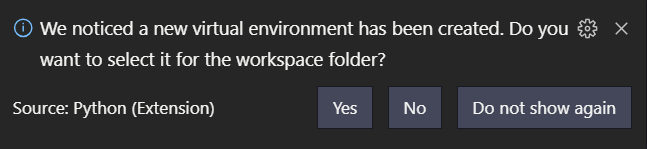

# Setup a virtual environment for Python in Visual Studio Code

Open Visual Studio Code in your project's folder.

Then open Python Terminal (Ctrl + Shift + P: Python: Create Terminal)

In the terminal:

```sh
python -m venv venv
```

You'll be prompted with the following dialog asking you to "select the new virtual environment for the workspace folder".



Click Yes, and your new venv is ready to go.

---

Open a new terminal within VSCode `Ctrl + Shift + P` and you'll see that venv is getting picked up; e.g.: (venv) ...

You can now instal packages as usual, e.g., `pip install sklearn`

To keep track of what is installed: `pip freeze > requirements.txt`

## Installing Modules

`Ctrl + Shift + P` and Terminal: Create New Integrated Terminal

from the terminal

Windows: `.\.venv\Scripts\activate`

Linux: `./.venv/bin/activate`

You can now instal packages as usual, e.g., `pip install sklearn.`

to stop working in virtual environment type: `deactivate`

### Note (Jupiter)

For [Jupyter](https://en.wikipedia.org/wiki/Project_Jupyter#Jupyter_Notebook), you need to do more - [Jupyter notebooks in Visual Studio Code does not use the active virtual environment](https://stackoverflow.com/questions/58119823/jupyter-notebooks-in-vscode-does-not-use-active-virtual-environment)
